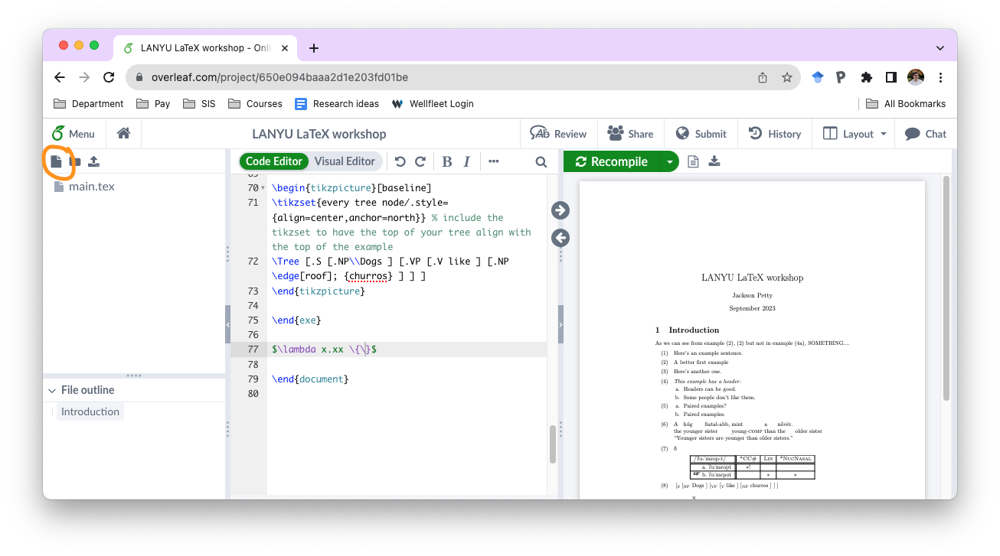
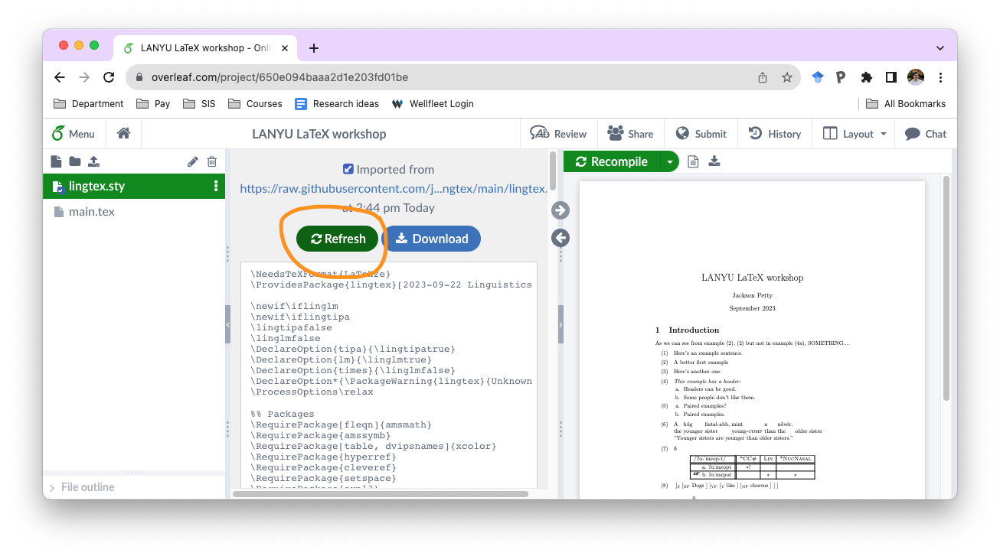

# lingtex

A collection of LaTeX files for linguists

## Use

### Using with Overleaf

Overleaf has a really nice feature where you can add files from an external URL. This means that you can add these files just by linking to them and, importantly, they will be updated with new versions every time you re-compile your document.

To do this, start by clicking on the "New File" button in the upper left corner of the UI:

Next, click on the "From External URL" tab:

Finally, enter the URL of the file you want to add. If you're adding from a GitHub repository like mine, you need to find the "raw" version of the file. For `lingtex.sty`, this is `https://raw.githubusercontent.com/jopetty/lingtex/main/lingtex.sty`.

This will add the file as a "linked file", which means that if the file gets updated in the repository, you can get the new version by just clicking the "Refresh" button for the file:

